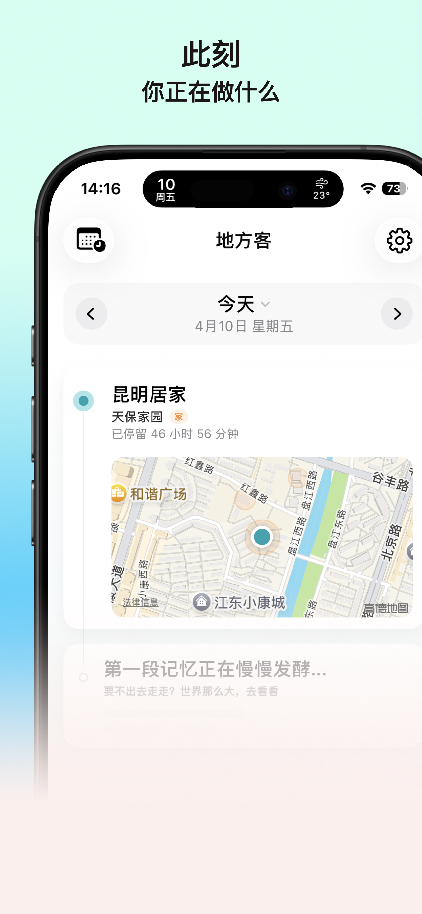
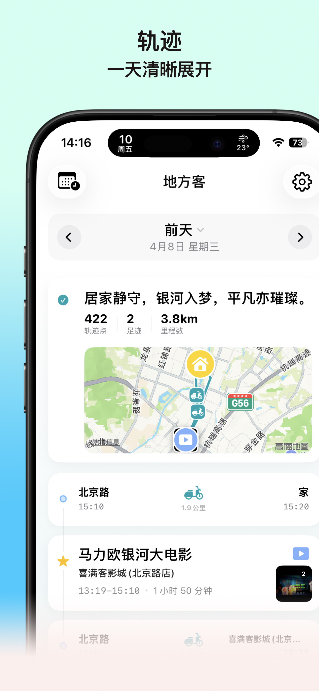
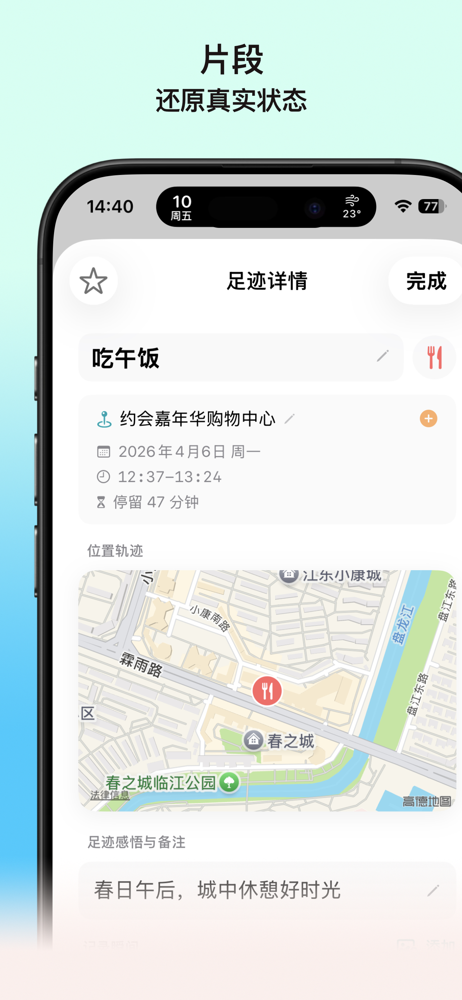
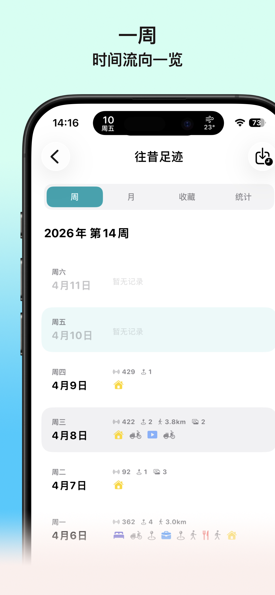
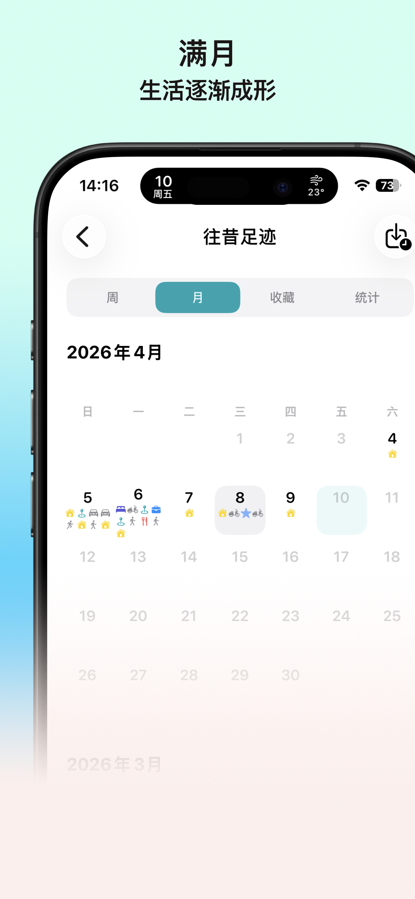
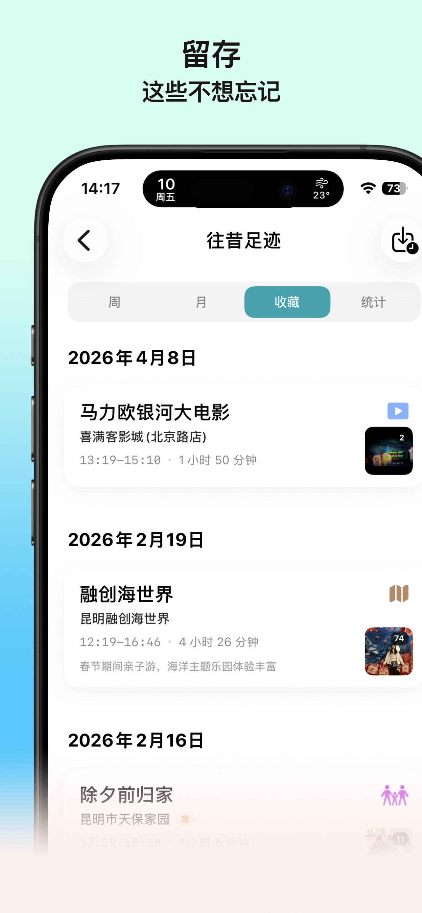
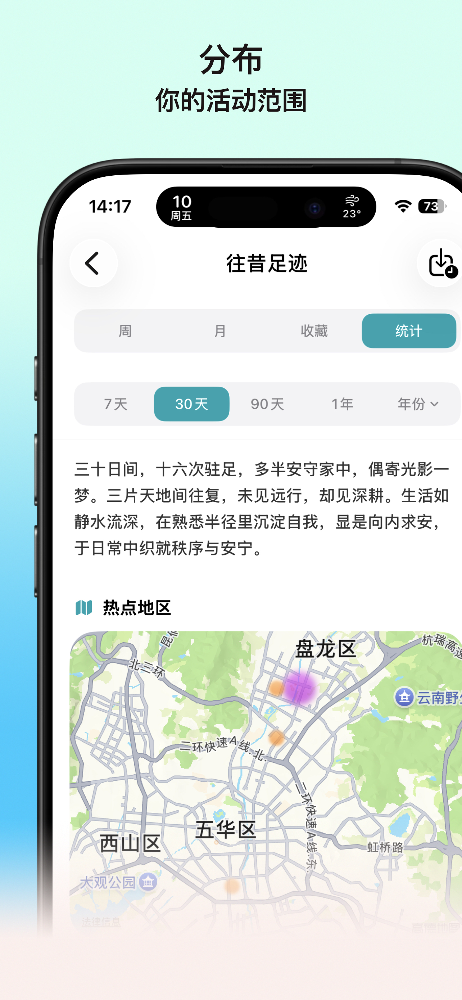
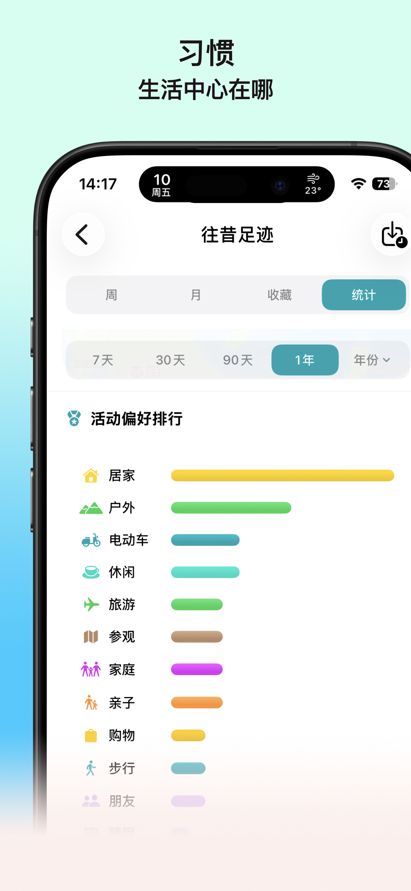
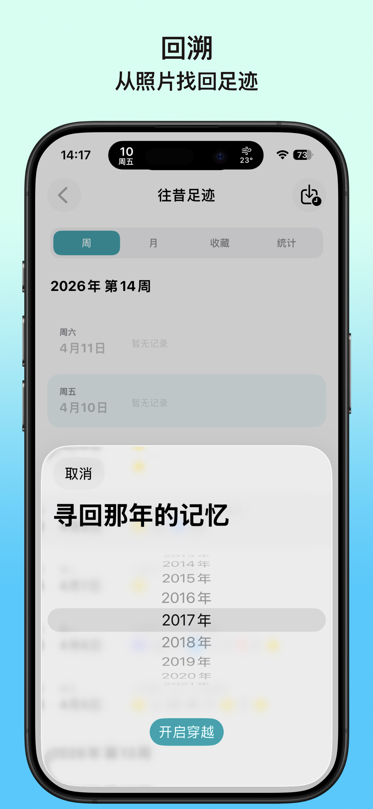

# 地方客 (DiFangKe)

> **走过的地方，就是你的生活。**

 

地方客是一款轻量的日常记录工具，帮你把生活留下来。它不强调复杂的统计，而是关注“人”与“活动”，让你更清晰地理解自己生活的节奏。

---

## 核心功能

- **记录行动轨迹**：自动或手动记录你去过的地方，形成完整的时间线。这不仅是冷冰冰的路径，更是带有“意义”的生活片段。
- **标记活动含义**：为每段足迹选择一个“活动类型”（如工作、用餐、通勤、娱乐），也可以自定义属于你自己的专属类型。
- **发现生活模式**：通过逐日积累，可视化你的时间分配，让你看见哪些时间在工作，哪些时间在放松。

## 设计理念

- **极简操作**：记录应该是顺手且自然的，尽可能减少操作成本。
- **意义优先**：比起“去了哪里”，更重要的是“在那里做了什么”，拒绝无效的数据堆积。
- **复盘价值**：让回看变得有价值，帮助你重新发现一天、一周甚至一个月的意义。

## 适合人群

- 想记录生活但不习惯写长篇日记的人
- 希望更清晰了解自己时间分配的人
- 想要捕捉日常节奏，留住生活瞬间的人
- 觉得每天忙碌却又说不清具体做了什么的人

## 应用截图

 
 
 

 
 
 

 
 
 

## 下载安装

或者直接下载 [APK](https://difang.app/download/difangke.apk?v=27)。

扫码访问官网：

## 隐私与支持

- [隐私政策](privacy.html)
